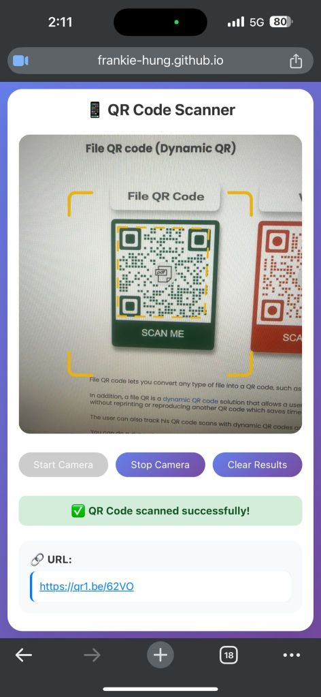

# 📱 Simple QR Code Scanner

A lightweight, browser-based QR code scanner web application that works directly in your mobile or desktop browser. No app installation required!

**🔗 Live Demo:** [https://frankie-hung.github.io/qr-reader/](https://frankie-hung.github.io/qr-reader/)

## 📸 Screenshot

## ✨ Features

- **Instant Scanning:** Uses your device's camera to scan QR codes in real-time.
- **Smart Detection:** Automatically identifies URLs, emails, phone numbers, and plain text.
- **Privacy First:** All processing happens locally in your browser. No images are sent to any server.
- **Mobile Optimized:** Responsive design that works perfectly on smartphones.
- **HTTPS Secure:** Requires secure connection for camera access.

## 🚀 How to Use

1. Open the [Live Demo](https://frankie-hung.github.io/qr-reader/) on your phone or computer.
2. Grant **Camera Permissions** when prompted.
3. Point your camera at a QR code.
4. View the result instantly on screen!

## 🛠️ Tech Stack

- **HTML5 / CSS3 / JavaScript**
- **[qr-scanner](https://github.com/nimiq/qr-scanner)** library for detection
- Hosted on **GitHub Pages**
- Generated with the help of **Claude 3.7 Sonnet**

## ⚠️ Troubleshooting

- **Camera not opening?** Ensure you are visiting the HTTPS version of the site.
- **Permission denied?** Check your browser settings to allow camera access for this site.
- **iOS Users:** Please use Safari for the best compatibility.

## 📄 License

This project is open source and available under the [MIT License](LICENSE).

---
*Created by Frankie Hung*
